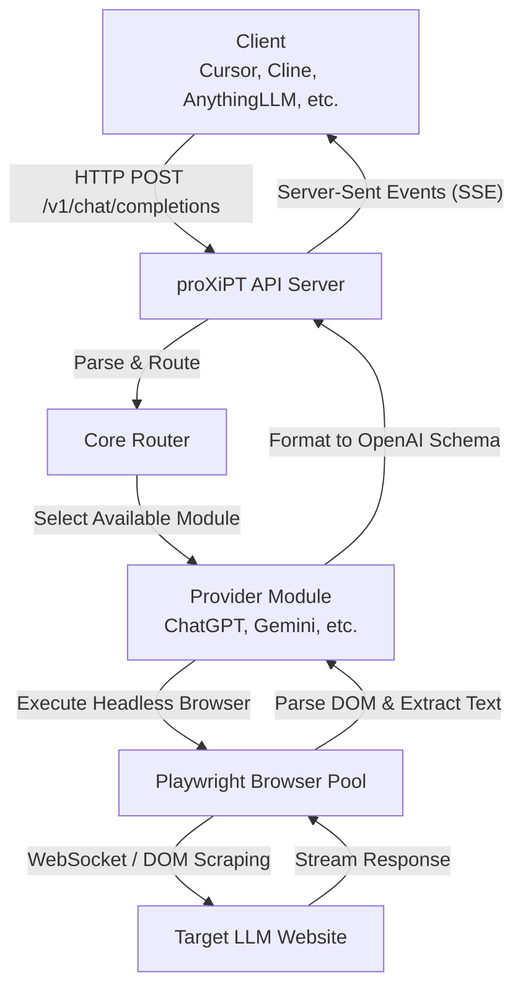
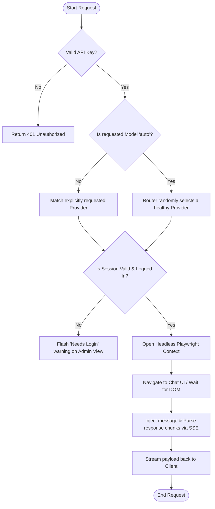
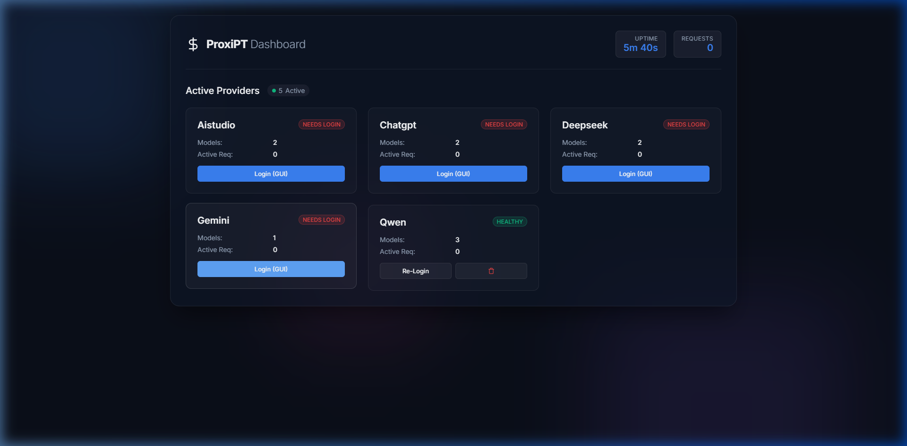
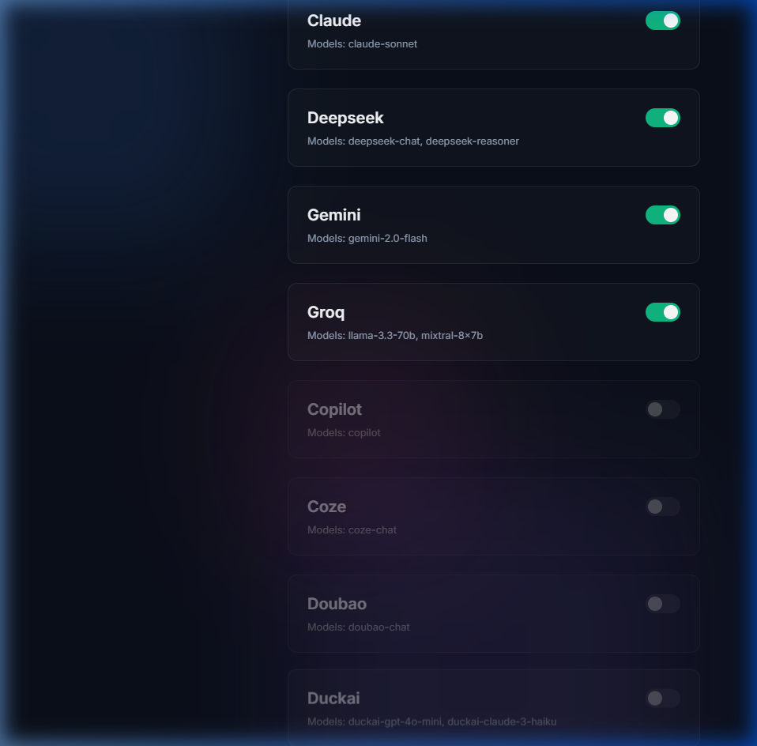
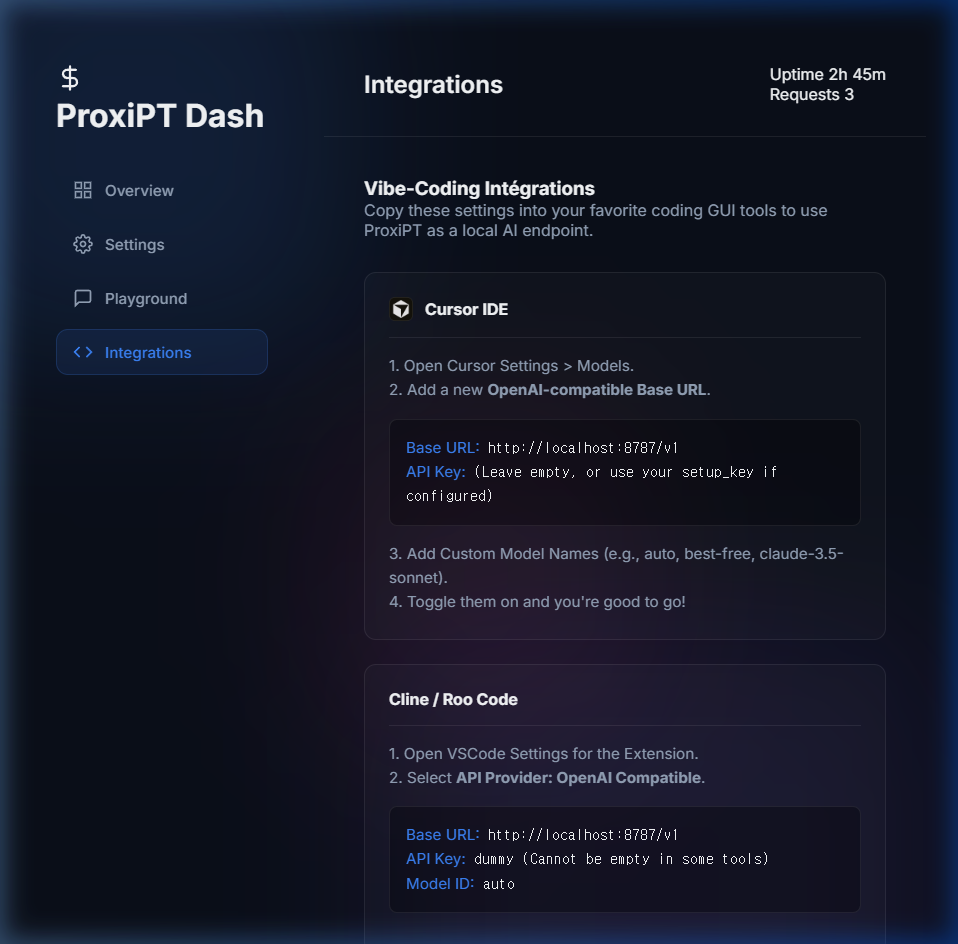
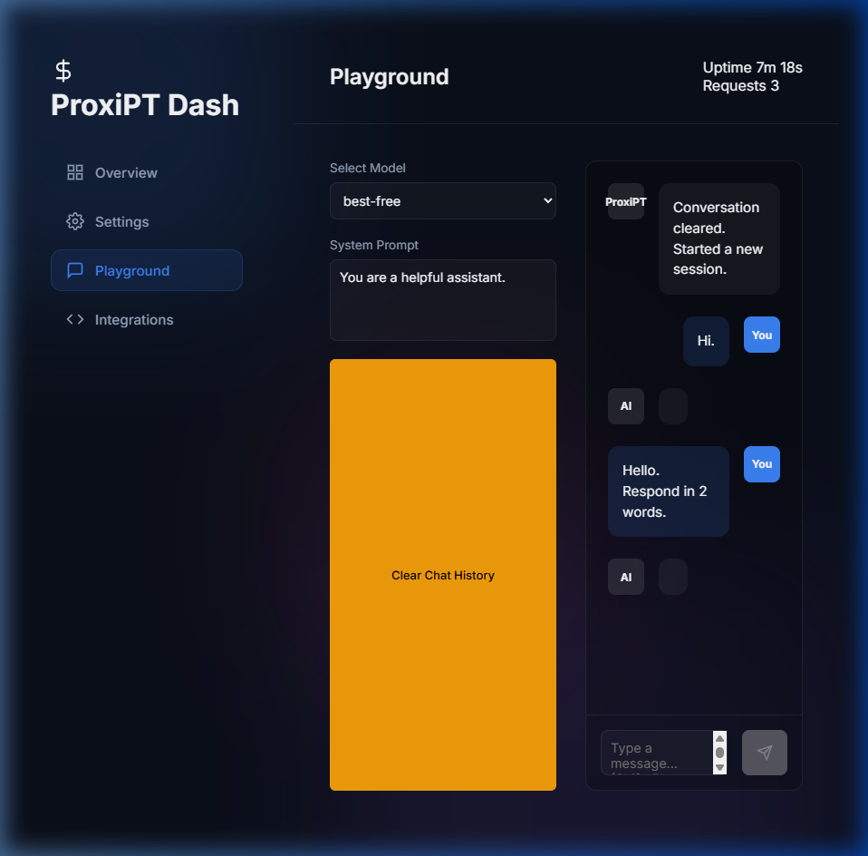

<div align="center">
  <h1>proXiPT</h1>
  <p><b>"For all ideas withering before the limits of tokens,"</b></p>
  <p>
    🇺🇸 English | <a href="README_ko.md">🇰🇷 한국어</a>
  </p>
</div>

<br/>

**proXiPT** is a Reverse Proxy server that transforms free Web-based LLM chat interfaces into fully OpenAI-compatible REST APIs. 
The name is a playful portmanteau: it encapsulates Web UI interactions and serves them via an API "Proxy," while harmonizing with the familiar phonetic rhythm of "GPT" and cleverly replacing the lowercase 'x' with 'X'.

With this tool, you can connect over two dozen distinct state-of-the-art LLMs securely via Playwright directly into AI-coding agents like Cursor, Roo Code (Cline), Langflow, and Dify—empowering limitless vibe-coding without worrying about API token budgets.

---

## 🌟 Key Features

- **23+ Integrated Free LLMs**: Headless support for global and regional powerhouses like ChatGPT, Gemini, DeepSeek, and Qwen.
- **Native OpenAI Compatibility**: Exposes a standard `/v1/chat/completions` server with streaming (SSE). Drop-in replacement for any tool expecting OpenAI.
- **Glassmorphism UI Dashboard**: Manage, toggle, and test providers instantly via a beautiful Web UI without modifying configuration files.
- **Auto-magic Reliability**: Automatic session storage and GUI toggle buttons to securely log in or bypass CAPTCHAs, switching seamlessly back to headless mode.
- **Intelligent Load Router**: Utilize generic model queries like `auto` or `best-free` to let the server intelligently load-balance across available and healthy providers.

---

## 🛠 Supported Providers

Easily toggle providers directly from the Dashboard app or by tweaking `config.yaml`.

| Tier | Services | Example Models | Requires Login |
| :---: | --- | --- | :---: |
| **Tier 1** | **ChatGPT** (`chatgpt.com`)<br>**Gemini** (`gemini.google.com`)<br>**AI Studio** (`aistudio.google.com`)<br>**DeepSeek** (`chat.deepseek.com`)<br>**Qwen** (`chat.qwen.ai`) | GPT-4o, 4o-mini<br>Gemini 2.0 Flash<br>Gemini 2.5 Pro<br>DeepSeek-R1<br>Qwen-Max | ✅<br>✅<br>✅<br>✅<br>❌ |
| **Tier 2** | **Groq Playground**<br>**HuggingChat**<br>**Mistral Le Chat**<br>**Duck.ai**<br>**Copilot**<br>**Poe**<br>**Perplexity**<br>**OpenRouter** | LLaMA 3, Mixtral<br>Command R+<br>Mistral Large<br>Meta LLaMA<br>Copilot<br>Claude, GPTs<br>Sonar<br>Various Open Models | ✅<br>❌<br>✅<br>❌<br>❌<br>✅<br>❌<br>✅ |
| **Tier 3** | **Kimi** (`moonshot.cn`)<br>**Doubao** (`doubao.com`)<br>**ChatGLM** (`chatglm.cn`)<br>**Yi Chat** (`01.ai`)<br>**Coze** (`coze.com`)<br>**You.com**<br>**Pi** (`pi.ai`)<br>**Meta AI** (`meta.ai`)<br>**Claude** (`claude.ai`) | Moonshot<br>Doubao<br>GLM-4<br>Yi-Large<br>Bot Defaults<br>YouPro<br>Inflection<br>Llama<br>Sonnet 3.5 | ✅<br>✅<br>✅<br>✅<br>✅<br>❌<br>❌<br>❌<br>✅ |

---

## 📂 Project Structure

```text
proXiPT/
├── src/proxipt/
│   ├── api/
│   │   ├── routes/
│   │   │   ├── admin.py          # Dashboard endpoints & Toggles
│   │   │   ├── chat.py           # Standard OpenAI completions endpoint
│   │   │   └── models.py
│   │   ├── static/               # Admin Dashboard Web UI (HTML/CSS/JS)
│   │   └── schemas.py
│   ├── core/
│   │   ├── browser_pool.py       # Playwright browser lifecycle manager
│   │   ├── router.py             # Advanced auto-routing & tracking
│   │   └── response_parser.py
│   ├── providers/                # 23 Built-in LLM integration scripts
│   ├── config.py
│   └── main.py
├── config.yaml                   # Underlying yaml configuration
├── pyproject.toml
├── start.bat                     # 1-click startup (Windows)
└── start.sh                      # 1-click startup (Mac/Linux)
```

---

## ⚙️ Architecture & Logic

### 1. Architecture Diagram


### 2. Request Flowchart


---

## 🚀 Getting Started

### 1. Server Installation

No terminal wizardry required.
- **Windows**: Just double-click the `start.bat` file in your folder.
- **Mac/Linux**: Open your terminal locally and run `./start.sh` (If permission is denied, run `chmod +x start.sh` first).

The scripts will automatically scaffold a clean Python virtual environment, download necessary frameworks including Playwright browsers, spin up the server, and **immediately open the Web Dashboard in your browser (`http://localhost:8787/dashboard`)**.

<p align="center">
  
</p>

*For manual configuration:*
```bash
python -m venv .venv
source .venv/bin/activate  # (Windows: .venv\Scripts\activate)
pip install -e "."
playwright install chromium
python -m proxipt.main
```

### 2. Service Configuration (Settings)

Configure your models straight from the Web UI once the server boots.

<p align="center">
  
</p>

1. **Toggle Providers**: Click the `Settings` icon in the navigation bar. Switch `ON` modules like Gemini, OpenRouter, or DeepSeek you wish to use.
2. **Session Interception**:
   - Go back to the `Overview` tab. If a provider says `Needs Login`, click its **"Login (GUI)"** button.
   - A visible Chrome window will spawn. Proceed to log in manually.
   - Once logged in and redirected to the chat UI, switch back to the Dashboard and push **"Close GUI & Save"**.
   - Your session is now saved indefinitely and operation yields back seamlessly to unseen, headless operations!

### 3. API Invocation

Your local, unlimited, OpenAI-compliant proxy endpoint is ready! Visit the **"Integrations"** tab on your dashboard for visual guides on connecting with IDEs.

<p align="center">
  
</p>

#### Linking to Cursor IDE / Cline
1. Open Cursor's settings by clicking the `Gear` icon and heading to `Models`.
2. Fill the **OpenAI API Key** field with any dummy text (e.g. `sk-proxipt`).
3. Toggle the **OpenAI Base URL** and inject: `http://localhost:8787/v1`
4. Add the custom name `auto` in the model search input box beneath and click `+` to lock it in.

#### Built-in Playground Testing
You can immediately test your setup without tools by utilizing the built-in Playground!

<p align="center">
  
</p>

#### Quick Python Sample Code
```python
import openai

client = openai.OpenAI(
    base_url="http://127.0.0.1:8787/v1",
    api_key="sk-dummy"  # It can literally be anything.
)

response = client.chat.completions.create(
    model="auto",       # Specific targets work too: "gpt-4o", "gemini-2.0-flash", etc.
    messages=[{"role": "user", "content": "You are a pro."}],
    stream=True
)

for chunk in response:
    print(chunk.choices[0].delta.content, end="")
```
