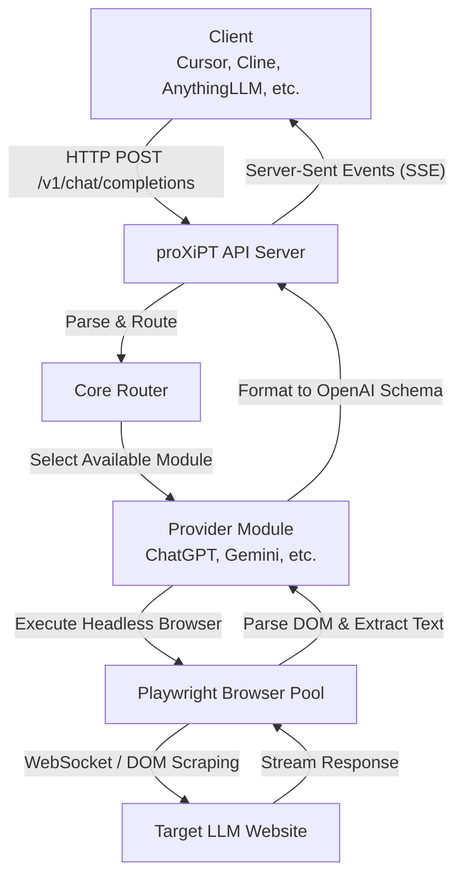
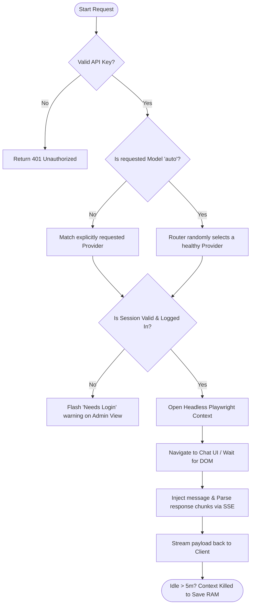

<div align="center">
  <h1>proXiPT</h1>
  <p><b>"For all ideas withering before the limits of tokens,"</b></p>
  <p>
    🇺🇸 English | <a href="README_KR.md">🇰🇷 한국어</a>
  </p>
</div>

<br/>

**proXiPT** is a Reverse Proxy server that transforms free Web-based LLM chat interfaces into fully OpenAI-compatible REST APIs. 
The name is a playful portmanteau: it encapsulates Web UI interactions and serves them via an API "Proxy," while harmonizing with the familiar phonetic rhythm of "GPT" and cleverly replacing the lowercase 'x' with 'X'.

With this tool, you can connect over two dozen distinct state-of-the-art LLMs securely via Playwright directly into AI-coding agents like Cursor, Roo Code (Cline), Langflow, and Dify—empowering limitless vibe-coding without worrying about API token budgets.

---

## 🌟 Key Features

- **23+ Integrated Free LLMs**: Headless support for global and regional powerhouses like ChatGPT, Gemini, DeepSeek, and Qwen.
- **Native OpenAI Compatibility**: Exposes a standard `/v1/chat/completions` server with streaming (SSE). Drop-in replacement for any tool expecting OpenAI.
- **Notion-Style Dashboard**: A clean, minimalist Web UI with a built-in Dark/Light mode toggle. Manage your providers and settings effortlessly.
- **Persistent Sessions for Cloud**: Designed to run smoothly on constrained VPS (like GCP e2-micro). It auto-suspends idle browsers to save RAM and allows easy session JSON uploads to keep you logged in permanently without a GUI.
- **Dynamic Model Sync**: Automatically fetches and updates the latest available models from providers in the background.

---

## 🛠 Supported Providers

Easily toggle providers directly from the Dashboard app or by tweaking `config.yaml`.

|    Tier    | Services                                                                                                                                                                                                                        | Example Models                                                                                                           |              Requires Login               |
| :--------: | ------------------------------------------------------------------------------------------------------------------------------------------------------------------------------------------------------------------------------- | ------------------------------------------------------------------------------------------------------------------------ | :---------------------------------------: |
| **Tier 1** | **ChatGPT** (`chatgpt.com`)<br>**Gemini** (`gemini.google.com`)<br>**AI Studio** (`aistudio.google.com`)<br>**DeepSeek** (`chat.deepseek.com`)<br>**Qwen** (`chat.qwen.ai`)                                                     | GPT-4o, 4o-mini<br>Gemini 2.0 Flash<br>Gemini 2.5 Pro<br>DeepSeek-R1<br>Qwen-Max                                         |           ✅<br>✅<br>✅<br>✅<br>❌           |
| **Tier 2** | **Groq Playground**<br>**HuggingChat**<br>**Mistral Le Chat**<br>**Duck.ai**<br>**Copilot**<br>**Poe**<br>**Perplexity**<br>**OpenRouter**                                                                                      | LLaMA 3, Mixtral<br>Command R+<br>Mistral Large<br>Meta LLaMA<br>Copilot<br>Claude, GPTs<br>Sonar<br>Various Open Models |   ✅<br>❌<br>✅<br>❌<br>❌<br>✅<br>❌<br>✅    |
| **Tier 3** | **Kimi** (`moonshot.cn`)<br>**Doubao** (`doubao.com`)<br>**ChatGLM** (`chatglm.cn`)<br>**Yi Chat** (`01.ai`)<br>**Coze** (`coze.com`)<br>**You.com**<br>**Pi** (`pi.ai`)<br>**Meta AI** (`meta.ai`)<br>**Claude** (`claude.ai`) | Moonshot<br>Doubao<br>GLM-4<br>Yi-Large<br>Bot Defaults<br>YouPro<br>Inflection<br>Llama<br>Sonnet 3.5                   | ✅<br>✅<br>✅<br>✅<br>✅<br>❌<br>❌<br>❌<br>✅ |

---

## 📂 Project Structure

```text
proXiPT/
├── src/proxipt/
│   ├── api/
│   │   ├── routes/
│   │   │   ├── admin.py          # Dashboard endpoints & Toggles
│   │   │   ├── chat.py           # Standard OpenAI completions endpoint
│   │   │   └── models.py
│   │   ├── static/               # Admin Dashboard Web UI (Notion-style)
│   │   └── schemas.py
│   ├── core/
│   │   ├── browser_pool.py       # Playwright memory-optimized pool manager
│   │   ├── router.py             # Advanced auto-routing & tracking
│   │   └── response_parser.py
│   ├── providers/                # 23 Built-in LLM integration scripts
│   ├── config.py
│   └── main.py
├── config.yaml                   # Underlying yaml configuration
├── pyproject.toml
├── start.bat                     # 1-click startup (Windows)
└── start.sh                      # 1-click startup (Mac/Linux)
```

---

## ⚙️ Architecture & Logic

### 1. Architecture Diagram


### 2. Request Flowchart


---

## 🚀 Getting Started

### 1. Server Installation

No terminal wizardry required.
- **Windows**: Just double-click the `start.bat` file in your folder.
- **Mac/Linux**: Open your terminal locally and run `./start.sh` (If permission is denied, run `chmod +x start.sh` first).

The scripts will automatically scaffold a clean Python virtual environment, download necessary frameworks including Playwright browsers, spin up the server, and **immediately open the Web Dashboard in your browser (`http://localhost:8787/dashboard`)**.

*For manual configuration:*
```bash
python -m venv .venv
source .venv/bin/activate  # (Windows: .venv\Scripts\activate)
pip install -e "."
playwright install chromium
python -m proxipt.main
```

### 2. Service Configuration (Settings)

Configure your models straight from the Web UI once the server boots.

1. **Toggle Providers**: Click the `Settings` tab in the navigation bar. Switch `ON` modules like Gemini, OpenRouter, or DeepSeek you wish to use.
2. **Session Interception (Local Setup)**:
   - Go back to the `Overview` tab. If a provider says `Needs Login`, click its **"Login (GUI)"** button.
   - A visible Chrome window will spawn. Proceed to log in manually.
   - Once logged in and redirected to the chat UI, switch back to the Dashboard and push **"Close GUI & Save"**.
   - Your session is now saved indefinitely and operation yields back seamlessly to unseen, headless operations!

### 3. Deploying to a Cloud VPS (e.g., GCP e2-micro)

Cloud servers lack graphical interfaces. To use proXiPT seamlessly 24/7 on a remote headless server:
1. Run proXiPT once on your **Local PC** and use the **Login (GUI)** button to sign in as described above.
2. This creates a `session.json` file in your local `sessions/` folder (e.g., `chatgpt_session.json`).
3. Deploy and start proXiPT on your Cloud server.
4. Open the Cloud server's dashboard, click the **Upload JSON** button for the respective provider, and select your local session file.
5. proXiPT will automatically keep the session alive indefinitely from that point forward!

### 3. API Invocation & Tool Integrations

Your local, unlimited, OpenAI-compliant proxy endpoint is ready! Here is how to configure **6 of the most popular AI Coding Agents and IDEs** to use your local `proXiPT` server. 

> **API Constraints Note:** 
> - **Base URL / Endpoint:** `http://localhost:8787/v1` (For some tools, explicitly use `/v1/chat/completions`)
> - **API Key:** `dummy` (or any arbitrary string; it is ignored by proXiPT but required by most tools)
> - **Model Name:** `auto` (Let proXiPT load-balance) or specific models like `gpt-4o`.

#### 1. Claude Code (Anthropic CLI)
Claude Code only speaks the Anthropic API format. To bridge it to ProxiPT, use the `litellm` proxy:
1. Install LiteLLM: `pip install litellm`
2. Start the proxy: `litellm --model openai/auto --api_base http://localhost:8787/v1 --api_key dummy`
3. Run Claude Code using the proxy port (usually 4000):
```bash
export ANTHROPIC_BASE_URL="http://localhost:4000"
export ANTHROPIC_API_KEY="dummy"
claude
```

#### 2. ClawCode (Harness CLI)
Since ClawCode is a clean-room rewrite of Claude Code, configure it via environment variables before launching:
```bash
export OPENAI_BASE_URL="http://localhost:8787/v1"
export OPENAI_API_KEY="dummy"
clawcode --model auto
```

#### 3. Cursor IDE
1. Open Cursor Settings (Gear icon) -> `Models`.
2. Toggle on the **OpenAI Base URL** and set it to: `http://localhost:8787/v1`
3. Enter `dummy` in the **OpenAI API Key** field.
4. Add the custom name `auto` in the model search input box beneath and click `+` to lock it in.

#### 4. OpenClaw (Autonomous OS Agent)
Configure the custom provider in `~/.openclaw/openclaw.json`:
```json
"models": {
  "providers": {
    "proxipt": {
      "base_url": "http://localhost:8787/v1",
      "api": "openai-completions",
      "api_key": "dummy"
    }
  }
}
```

#### 5. Zed IDE
Open your `settings.json` via `cmd+,` and configure the assistant language models:
```json
"language_models": {
  "openai": {
    "api_url": "http://localhost:8787/v1",
    "available_models": [{"name": "auto", "max_tokens": 128000}]
  }
}
```

#### 6. AutoGPT
Modify your `.env` file to route the core ChatGPT calls to your local server:
```env
OPENAI_API_BASE_URL="http://localhost:8787/v1"
OPENAI_API_KEY="dummy"
SMART_LLM="auto"
FAST_LLM="auto"
```

#### Quick Python Sample Code
```python
import openai

client = openai.OpenAI(
    base_url="http://127.0.0.1:8787/v1",
    api_key="dummy"
)

response = client.chat.completions.create(
    model="auto",
    messages=[{"role": "user", "content": "You are a pro."}],
    stream=True
)

for chunk in response:
    print(chunk.choices[0].delta.content, end="")
```
