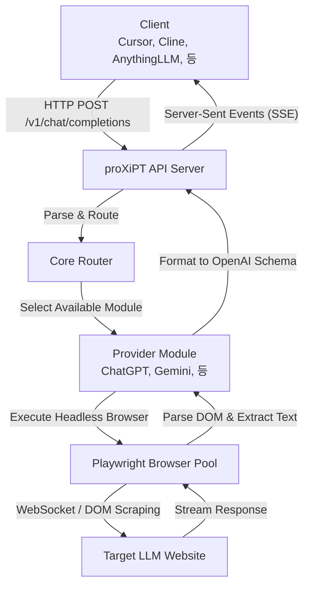
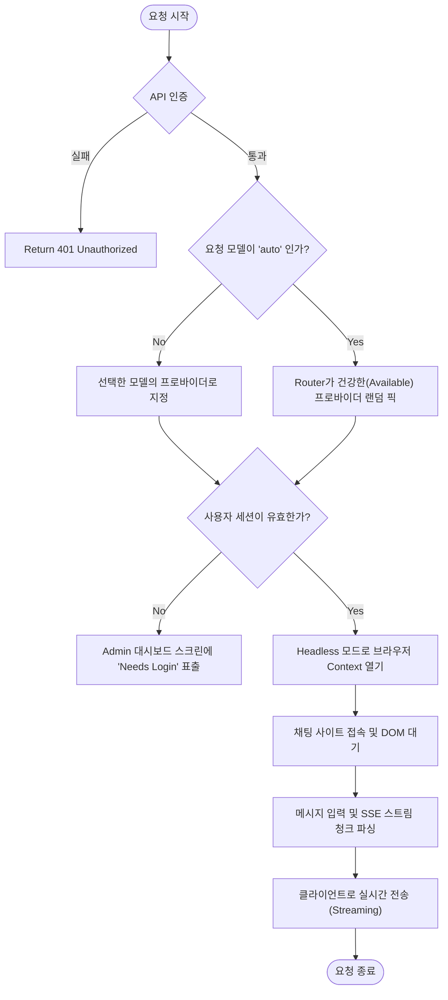

<div align="center">
  <h1>proXiPT</h1>
  <p><b>"토큰의 한계 앞에 시들어가는 모든 아이디어들을 위해,"</b></p>
  <p>
    <a href="README.md">🇺🇸 English</a> | 🇰🇷 한국어
  </p>
</div>

<br/>

**proXiPT**는 웹사이트 기반의 무료 LLM 채팅 UI를 OpenAI 호환 REST API로 변환해주는 **리버스 프록시(Reverse Proxy)** 서버입니다. 
웹상의 채팅을 API로 끌어온다는 뜻의 'Proxy'와 'GPT'의 발음이 유사한 점에 착안한 이름으로, 소문자 x를 'X'로 표기하는 재미를 담았습니다.

이 프로젝트를 활용하면 API 종량제 요금 걱정 없이 Cursor, Cline (Roo Code), Langflow, Dify 등 AI 코딩 및 워크플로우 툴에 수십 개의 최상급 LLM을 무제한으로 연결해 진정한 'Vibe-Coding'을 경험할 수 있습니다.

---

## 🌟 주요 특징 (Features)

- **23개 이상의 무료 LLM 내장**: ChatGPT, Gemini, DeepSeek, Qwen 등 글로벌 모델 완벽 지원. Headless 모드로 동작합니다.
- **OpenAI 완벽 호환**: 표준 `/v1/chat/completions` 스트리밍(SSE)을 지원하므로 기존의 모든 AI 툴에 드롭인(Drop-in) 교체가 가능합니다.
- **초보자 친화적 웹 대시보드 (Glassmorphism UX)**: 복잡한 터미널이나 설정 파일 수정 없이, 우아한 구성을 갖춘 웹 UI에서 토글 버튼으로 직관적인 모델 관리가 가능합니다.
- **안정적인 Playwright 풀링**: 세션 자동 저장 및 GUI 브라우저 전환을 통한 손쉬운 캡차 우회 통합 지원.
- **스마트 라우팅**: `auto`, `best-free` 등의 모델명을 호출하면, 연결 가능한 가장 건강한 프록시 제공자들 사이에서 자동 로드 밸런싱을 수행합니다.

---

## 🛠 지원 제공자 (Supported Providers)

대시보드의 스위치 버튼 또는 `config.yaml` 환경설정을 통해 23개의 제공자를 손쉽게 활성화할 수 있습니다.

| Tier | 지원 서비스 | 제공 모델 예시 | 로그인 필요 여부 |
| :---: | --- | --- | :---: |
| **Tier 1** | **ChatGPT** (`chatgpt.com`)<br>**Gemini** (`gemini.google.com`)<br>**AI Studio** (`aistudio.google.com`)<br>**DeepSeek** (`chat.deepseek.com`)<br>**Qwen** (`chat.qwen.ai`) | GPT-4o, 4o-mini<br>Gemini 2.0 Flash<br>Gemini 2.5 Pro<br>DeepSeek-R1<br>Qwen-Max | ✅<br>✅<br>✅<br>✅<br>❌ |
| **Tier 2** | **Groq Playground**<br>**HuggingChat**<br>**Mistral Le Chat**<br>**Duck.ai**<br>**Copilot**<br>**Poe**<br>**Perplexity**<br>**OpenRouter** | LLaMA 3, Mixtral<br>Command R+<br>Mistral Large<br>Meta LLaMA<br>Copilot<br>Claude, GPTs<br>Sonar<br>Various Open Models | ✅<br>❌<br>✅<br>❌<br>❌<br>✅<br>❌<br>✅ |
| **Tier 3** | **Kimi** (`moonshot.cn`)<br>**Doubao** (`doubao.com`)<br>**ChatGLM** (`chatglm.cn`)<br>**Yi Chat** (`01.ai`)<br>**Coze** (`coze.com`)<br>**You.com**<br>**Pi** (`pi.ai`)<br>**Meta AI** (`meta.ai`)<br>**Claude** (`claude.ai`) | Moonshot<br>Doubao<br>GLM-4<br>Yi-Large<br>Bot Defaults<br>YouPro<br>Inflection<br>Llama<br>Sonnet 3.5 | ✅<br>✅<br>✅<br>✅<br>✅<br>❌<br>❌<br>❌<br>✅ |

---

## 📂 프로젝트 구조 (Project Structure)

```text
proXiPT/
├── src/proxipt/
│   ├── api/
│   │   ├── routes/
│   │   │   ├── admin.py          # 관리자용 대시보드 API (수정, 상태 변경)
│   │   │   ├── chat.py           # OpenAI 형식 /v1/chat/completions 대응
│   │   │   └── models.py
│   │   ├── static/               # Admin 대시보드 웹앱 (JS/CSS/HTML)
│   │   └── schemas.py
│   ├── core/
│   │   ├── browser_pool.py       # Playwright 브라우저 생명주기 관리
│   │   ├── router.py             # 오토 라우터 & 이중화 분산
│   │   └── response_parser.py
│   ├── providers/                # 23 Built-in LLM 모듈 구현체
│   ├── config.py
│   └── main.py
├── config.yaml                   # YAML 기반 핵심 환경설정
├── pyproject.toml
├── start.bat                     # Windows 원클릭 실행기
└── start.sh                      # Mac/Linux 원클릭 실행기
```

---

## ⚙️ 작동 방식 및 아키텍처

### 1. 아키텍처 다이어그램 (Architecture)


### 2. 요청 처리 순서도 (Flowchart)


---

## 🚀 사용 방법 안내 (Getting Started)

### 1. 서버 구동 (Installation)

터미널이나 코딩 지식이 없어도 구축이 가능하도록 스크립트를 제공합니다:
- **Windows**: 폴더 내의 `start.bat` 파일을 더블 클릭합니다.
- **Mac/Linux**: 셸을 열고 `./start.sh` 를 실행합니다. (권한 오류 발생시 `chmod +x start.sh` 입력 후 시도)

스크립트가 알아서 가상환경을 구성하고, 브라우저 조종에 필요한 툴라이브러리를 설치한 뒤, 서버를 가동시킵니다.
> ✅ **가동 직후 브라우저에서 자동으로 대시보드 화면이 띄워집니다. (`http://localhost:8787/dashboard`)**

<p align="center">
  
</p>

*수동 설치를 원하신다면:*
```bash
python -m venv .venv
source .venv/bin/activate  # (Windows: .venv\Scripts\activate)
pip install -e "."
playwright install chromium
python -m proxipt.main
```

### 2. 서비스 설정 방법 (Settings)

서버가 실행되었다면, 팝업된 **Admin 대시보드** 메뉴를 통해 직관적으로 설정을 변경할 수 있습니다.

<p align="center">
  
</p>

1. **설정 활성화**: 좌측 내비게이션 바에서 두 번째 'Settings' 탭을 누릅니다. 사용하고자 하는 모듈의 우측 토글 스위치를 활성화(파란색)시킵니다.
2. **로그인 연동**: 이 프록시는 사용자의 계정을 필요로 하는 모듈들이 있습니다. 
   - `Overview` 탭으로 돌아와 `Needs Login` 이라 표시된 모듈의 **"Login (GUI)"** 버튼을 클릭합니다.
   - 팝업되는 가시적인 크롬 브라우저 상에서 직접 로그인을 진행하세요.
   - 로그인이 성공적으로 이뤄지고 웹 채팅 창이 나오면, 대시보드의 **"Close GUI & Save"** 버튼을 발동합니다.
   - 이후부터는 프로그램이 보이지 않는 Headless 상태에서 무인으로 구동됩니다!

### 3. API 호출 방법 및 주요 6대 AI 툴 연동

완벽하게 뒤에서 돌아가는 무제한 OpenAI 호환 서버를 얻으셨습니다. 아래 가이드를 따라 **가장 인기 있는 6종류의 AI 코딩 에이전트 및 IDE**에 연결해 보세요.

> **공통 설정 가이드** 
> - **API 엔드포인트(Base URL):** `http://localhost:8787/v1` (도구에 따라 끝에 `/chat/completions`를 붙여야 할 수도 있습니다)
> - **API Key:** `dummy` (아무 문자열이나 가능. proXiPT는 키를 검증하지 않습니다)
> - **Model Name:** `auto` (자율 로드밸런싱) 또는 `gpt-4o` 등 특정 모델명

#### 1. Claude Code (Anthropic CLI)
Claude Code는 Anthropic API 형식만 통신이 가능합니다. ProxiPT와 연결하려면 `litellm` 프록시가 필요합니다:
1. 터미널에서 LiteLLM 설치: `pip install litellm`
2. Anthropic 요청을 OpenAI로 번역해주는 프록시 실행: `litellm --model openai/auto --api_base http://localhost:8787/v1 --api_key dummy`
3. 새 터미널에서 LiteLLM 포트(기본 4000)를 바라보게 한 뒤 실행:
```bash
export ANTHROPIC_BASE_URL="http://localhost:4000"
export ANTHROPIC_API_KEY="dummy"
claude
```

#### 2. ClawCode (터미널 하네스 CLI)
Claude Code의 오픈소스 클론인 ClawCode는 터미널 환경 변수로 간단히 주입 가능합니다.
```bash
export OPENAI_BASE_URL="http://localhost:8787/v1"
export OPENAI_API_KEY="dummy"
clawcode --model auto
```

#### 3. Cursor IDE
1. Cursor의 환경설정 (톱니바퀴 아이콘) -> `Models` 메뉴 이동
2. **OpenAI API Key** 란에 아무 단어나 기재합니다 (예: `dummy`)
3. **OpenAI Base URL** 란을 활성화 시키고 아래 주소를 적으세요: `http://localhost:8787/v1`
4. 하단 모델 목록 추가창에 `auto` 라고 적고 `+` 버튼을 눌러 추가하면 끝입니다!

#### 4. OpenClaw (운영체제 제어 자율 에이전트)
`~/.openclaw/openclaw.json` 설정 파일에 커스텀 제공자를 등록합니다.
```json
"models": {
  "providers": {
    "proxipt": {
      "base_url": "http://localhost:8787/v1",
      "api": "openai-completions",
      "api_key": "dummy"
    }
  }
}
```

#### 5. Zed IDE
`cmd+,` 단축키를 눌러 `settings.json`을 열고 어시스턴트 모델 부분을 교체합니다:
```json
"language_models": {
  "openai": {
    "api_url": "http://localhost:8787/v1",
    "available_models": [{"name": "auto", "max_tokens": 128000}]
  }
}
```

#### 6. AutoGPT
`.env` 파일 수정을 통해 API 요청을 로컬로 리디렉션합니다.
```env
OPENAI_API_BASE_URL="http://localhost:8787/v1"
OPENAI_API_KEY="dummy"
SMART_LLM="auto"
FAST_LLM="auto"
```

#### 💡 기타: 파이썬 코드로 직접 호출하기 (예제)
```python
import openai

client = openai.OpenAI(
    base_url="http://127.0.0.1:8787/v1",
    api_key="sk-dummy"  # 아무키나 입력해도 패스됩니다.
)

response = client.chat.completions.create(
    model="auto",
    messages=[{"role": "user", "content": "너는 이제 프로야."}],
    stream=True
)

for chunk in response:
    print(chunk.choices[0].delta.content, end="")
```
